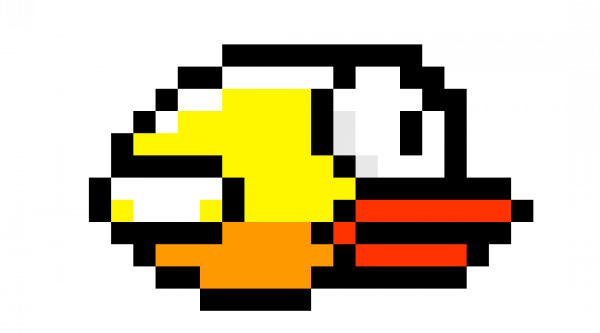

# 🐦 Flappy Bird Rehab — Hand Gesture Controlled Game

A **hand-gesture-controlled Flappy Bird game** designed for rehabilitation purposes. Available as both a **desktop application** (Pygame) and a **web application** (React + FastAPI) — play anywhere on any device!



---

## 🎮 Features

- **🖐️ Hand Gesture Control** — Close your hand in front of the webcam to make the bird flap
- **⌨️ Multiple Input Methods** — Keyboard (Space), mouse click, touch tap, or hand gesture
- **📊 Progress Tracking** — Scores, session history, and improvement trends saved to MySQL
- **🏆 Leaderboard** — Compete with other players and see daily statistics
- **⏱️ Play Time Limit** — 20-minute daily limit for rehabilitation compliance
- **📱 Responsive Design** — Works on desktop, tablet, and mobile browsers
- **🔐 Patient Authentication** — Secure login with password (bcrypt + JWT)

---

## 🚀 Getting Started

### Prerequisites

- **Python** 3.10+
- **Node.js** 18+ (22.12+ recommended)
- **MySQL** 8.0+ with a database named `rehab_wings`

### 1. Clone the Repository

```bash
git clone https://github.com/Nihith303/rehab-wings-website-version.git
cd rehab-wings-website-version
```

### 2. Set Up the Database

Create a MySQL database:

```sql
CREATE DATABASE IF NOT EXISTS rehab_wings;
```

> The backend will automatically create the required tables (`patients`, `game_sessions`) on startup.

### 3. Configure Environment Variables

Create `backend/.env`:

```env
DB_HOST=localhost
DB_PORT=3306
DB_NAME=rehab_wings
DB_USER=root
DB_PASSWORD=your_password_here

SECRET_KEY=your-secret-key-here
ALGORITHM=HS256
ACCESS_TOKEN_EXPIRE_MINUTES=1440
```

---

## 🌐 Running the Web Application

### Backend (FastAPI)

```bash
cd backend
pip install -r requirements.txt
python -m uvicorn main:app --reload --port 8000
```

The API will be available at `http://localhost:8000`

**API Documentation**: Visit `http://localhost:8000/docs` for interactive Swagger UI.

### Frontend (React)

```bash
cd frontend
npm install
npm run dev
```

The web app will be available at `http://localhost:5173`

---

## 🖥️ Running the Desktop Game

```bash
pip install -r requirements.txt
python game.py
```

> Requires a webcam for hand gesture detection.

---

## 🛠️ Tech Stack

| Layer | Technology |
|-------|-----------|
| **Frontend** | React 18, Vite 5, TailwindCSS 3, Axios |
| **Backend** | FastAPI, SQLAlchemy, Uvicorn |
| **Database** | MySQL 8.0 |
| **Auth** | bcrypt (password hashing), JWT (session tokens) |
| **Game Engine** | HTML5 Canvas (web), Pygame (desktop) |
| **Hand Tracking** | MediaPipe.js (web), MediaPipe + OpenCV (desktop) |

---

## 🎯 Game Controls

| Input | Platform | Action |
|-------|----------|--------|
| `Spacebar` | Desktop browser | Flap |
| `Click` | Desktop browser | Flap |
| `Tap` | Mobile browser | Flap |
| `Close Hand` ✊ | Webcam (any) | Flap |

---

## 📡 API Endpoints

### Patients
| Method | Endpoint | Description |
|--------|----------|-------------|
| `POST` | `/api/patients/register` | Register new patient with password |
| `POST` | `/api/patients/login` | Login and receive JWT token |
| `POST` | `/api/patients/set-password` | Set password for desktop-migrated patients |
| `GET` | `/api/patients/{id}/stats` | Get player statistics |

### Game Sessions
| Method | Endpoint | Description |
|--------|----------|-------------|
| `POST` | `/api/game/start` | Start a game session |
| `POST` | `/api/game/end` | End session, save score & duration |
| `GET` | `/api/game/check-playtime/{id}` | Check remaining daily playtime |

### Leaderboard
| Method | Endpoint | Description |
|--------|----------|-------------|
| `GET` | `/api/leaderboard` | Top high scores |
| `GET` | `/api/leaderboard/daily` | Daily aggregated statistics |
| `GET` | `/api/leaderboard/sessions/{id}` | Session history for a player |

---

## 🗄️ Database Schema

### `patients`
| Column | Type | Description |
|--------|------|-------------|
| `id` | INT (PK, AI) | Primary key |
| `name` | VARCHAR(100) | Patient name |
| `patient_id` | VARCHAR(50, UNIQUE) | Unique patient identifier |
| `password_hash` | VARCHAR(255) | bcrypt password hash (nullable for desktop patients) |
| `high_score` | INT | All-time high score |
| `created_at` | TIMESTAMP | Account creation time |
| `updated_at` | TIMESTAMP | Last update time |

### `game_sessions`
| Column | Type | Description |
|--------|------|-------------|
| `id` | INT (PK, AI) | Primary key |
| `patient_id` | VARCHAR(50, FK) | References `patients.patient_id` |
| `session_date` | DATE | Date of the session |
| `start_time` | TIME | Session start time |
| `end_time` | TIME | Session end time |
| `duration_seconds` | INT | Total session duration |
| `score` | INT | Score achieved in the session |

---

## 🤝 Desktop ↔ Web Compatibility

Both the desktop and web versions share the **same MySQL database** (`rehab_wings`). This means:

- ✅ Patients created on the desktop app can log in on the web (they'll be prompted to set a password)
- ✅ Scores from both versions appear in the same leaderboard
- ✅ Session history combines desktop and web play data
- ✅ The `password_hash` column is auto-added to the existing table if missing

---

## 📄 License

This project is for rehabilitation and educational purposes.

---

## 👤 Author

**Nihith** — [GitHub](https://github.com/Nihith303)
